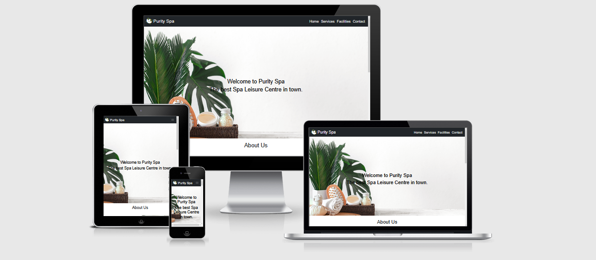
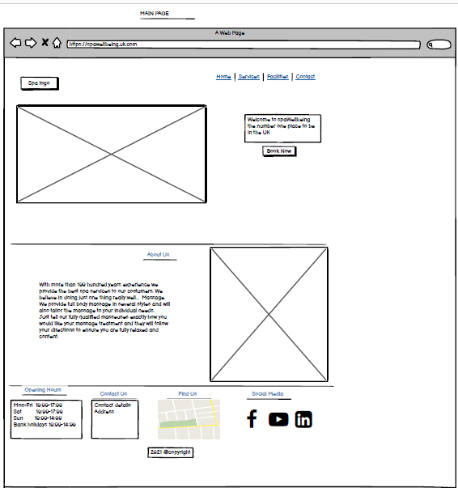
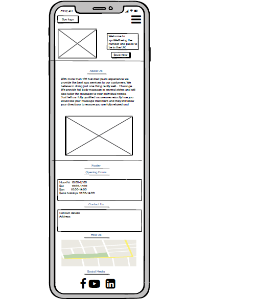
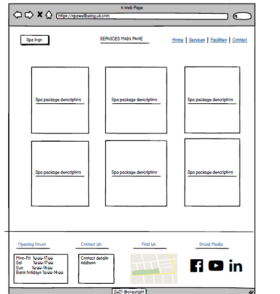
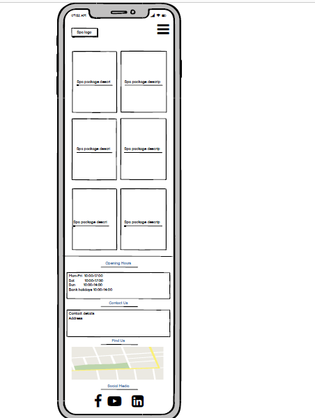
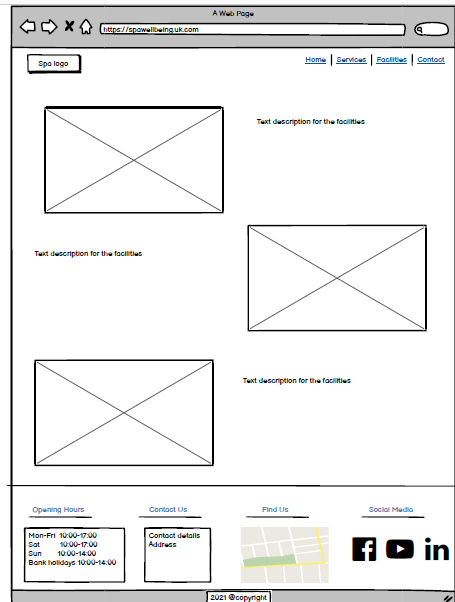
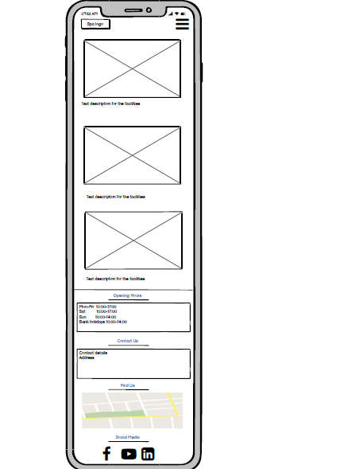
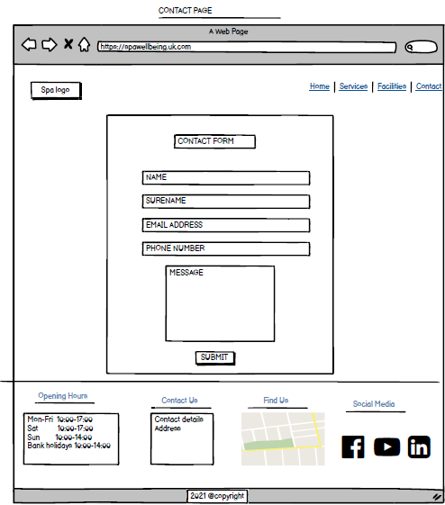
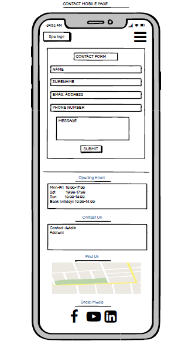

<h1 align ="center">Purity Spa Website</h1>

## <h3 align="center"> User-Centric Frontend Development First Milestone Project. </h3>

This is a Purity Spa Website, a fictional Spa Leisure Centre, which is targeted at the prospective clients who are interested in experiencing spa treatments and other spa facilities offered. This static-website is designed to be responsive and accessible on all types of devices and created for
educational purposes, to show my understanding and skills in design and development using HTML CSS and Bootstrap.

# Table of contents

- [UX](#ux)
    - [Website owner business goals](#website-owner-business-goals)
    - [User goals](#user-goals)
        - [New user goals](#new-user-goals)
        - [Returning user goals](#returning-user-goals)
        - [Website owner business goals](#website-owner-business-goals)
    - [User stories](#user-stories)
    - [Structure of the website](#structure-of-the-website)
    - [Wireframes](#wireframes)
        - [Home page](#home-page)
        - [Services page](#services-page)
        - [Facilities page](#facilities-page)
        - [Contact-page](#contact-page)
    - [Surface](#surface)
- [Features](#features)
- [Technology](#technology)
- [Testing](#testing)
    - [Functionality testing](#functionality-testing)
    - [Compatibility testing](#compatibility-testing)
    - [Code Validation](#code-validation)
    - [User stories testing](#user-stories-testing)
    - [Issues found during site development](#issues-found-during-site-development)
    - [Performance testing](#performance-testing)
- [Deployment](#deployment)
- [Credits](#credits)
- [Screenshots](#screenshots)

# UX

## Website owner business goals

-----------------------------

## User Goals

### New User goals:

-User will be able to find information about  spa services. 
-User will be able to find a description of what treatments are included in the packages.
-User will be able to see the facilities of the spa centre. 
-User will be able to find where the spa centre is located and the contact details.

### Returning User goals
*	User can find out  what packages are on offer. 
*	User is able to book a treatment they like. 
*	User will able to find the closing and opening hours. 
*	User can contact with the spa centre using the contact form.

### As a business owner:

*	I want to present potential costumers information about the spa center so that they understand what facilities and services are available there.
*	I want the potential costumers to be able to book spa treatments easily. 
*	I want the potential costumers to be able to find where the spa center is located, its opening hours, packages and their respective prices. 
*	I want to make sure that the potential clients will be able to contact with the spa centre and easily using the contact form. 

## User Stories 

### As a new costumer:
*	I want to be convinced as to why should I become a costumer of this spa center. 
*	I would like to find a detailed description of the treatments are being offered in the packages. 
*	I would like to find out where the spa centre is located and the contact details for making enquiries. 
*	I want to find out the opening and closing hours.
*	I want to find out what facilities are available.
*	I want to view the cost of the spa services. 

### As a returning costumer:
*	I would like to see what packages are on offer. 
*	I would like to be able to easily book a treatment. 
*	I would like to see the duration of each treatment. 

## Structure of the website

This is a user-friendly website, which adjust for different screen sizes and vieports of any device. The website can automatically resize, hide, shrink, or enlarge on desktop, tablet or mobile and look the same good on all screen sizes while ensuring usability and user satisfaction.

## Wireframes

The UI wireframing tool I used to create wireframes for each page as it would appear on desktop and mobile view was  [Balsamiq](https://balsamiq.com/).
### Home Page

  
   

### Services Page 

  
   

### Facilities Page 

  
   

### Contact Page

  
   

## Surface

### Colors
The colour scheme was chosen with the main color a shade of green, which stands for balance, nature and rebirth and intended to envoke prosperity and freshness to the potential spa costumers. 

  

Main colours used in a project:
* background color: #FFFFFF and #336600
* font color, navigation-bar and footer: #222224
* hover color: #696969
* ---- #D3D3D3

### Fonts 

* ----------------------------------------------------

### Images
Websites used to source royalty free images.
    
  * [Pexels](www.pexels.com). 
  * [Pixabay](www.pixabay.com).
  * [Unspalsh.com](www.unsplash.com).

[Back to Table of contents](#table-of-contents)
    
# Features
The website consists of 6 pages. Four are accessible from a navigation menu.
One is a 404 error page and one is a submission confirmation page for a form.

The website has below features:

## Navigation bar

-The navigation bar appears on the top, providing meaningfull titles for each of the four pages, is fully responsive and condenses to a 'hamburger icon' on mobile and tablet devices.
On the left side there is a logo, made by a font Awesome icon to visually illustrate the topic and name of the website and link to the main page.
On the right side there are the links for each of the four pages Home, Services, Facilities and Contact.

## Footer

* Footer is consistent on each page including contact details such as spa opening hours, address, location and social media. The footer is responsive and can be displayed on all devices, allowing the user to have the information needed without leaving the page they are on. 

## Features by page

### Home
 - A full-screen **hero image** draws the user's attention immediately upon entering the site with an animated heading of a brand name. 
 -The About Us section, allows the user to be welcomed on the site while having information about the spa centre and providing an eye-catching image of electric     humidifier, with the understanding of a pleasant atmosphere full of relaxing aromas. 
- The benefits of massage section, informs the users with the therapeutic effects and benefits of massage while allowing them to interact with the website by pressing the button to watch a relevant **video**. 

 ### Services

 -A full-width plant **banner image**,  displays a restful and relaxing picture for the user eye to view while entering the product page and reaffirm the brand's name on heading. 
-A services section provides the user with the  treatments description, sales and new products displayed on **cards** and divided into categories.
The white background helps the product content stands out while the full-width **jumbotron images** placed on the beginning of each category calling for extra attention and positively influence the decision-making process of the potential buyers.

### Facilities
    
 -A full-width plant **banner image** with a brand-name heading, is displayed for advertising repetition purposes. An eye-catching **font awesome icons** used above each facilities description for increasing the understanding of the facility at a glance. 
-**Call-to-action buttons** placed below facilities description, allow the user to check the availability by linking them to the corresponding timetable. 
-A **tabbed navigation pane**, allows users to get informed about the timetable of facilities operation and let them know about days and times the service offered while easily tab instead of scrolling.

## Contact

-A **banner image** with a question heading encourages the users to get in touch with the spa centre. A contact us form, asks for user's contact details, the type of their enquiry and message to be typed in the text area. 

##  Future implementations

* Contact form to be submitted and costumers' data to be sent to a server. 
* An online payment system so costumers can buy spa treatments and pay immediatly from the site.
* An online booking system for costumers to book the spa tratments.
* The brand domain name to be given to the website.

[Back to Table of contents](#table-of-contents)

  
 # Technologies used:
    
-Languages:

* [HTML5](http://en.wikipedia.org/wiki/HTML5)
 Used to structure the content as structure language.

* [CSS3](http://en.wikipedia.org/wiki/CSS)
 Used to style the content.

* [Bootstrap v.5.0](https://getbootstrap.com/docs/5.0/getting-started/introduction/)
 Used as a main framework to make the project responsive on all devices.
 
* [JavaScript](https://en.wikipedia.org/wiki/JavaScript)
 Used for the bootstrap nav bar and tabbed navigation pane.
    
-Websites

* [Font Awesome](https://fontawesome.com/). Used to obtain the logo icon in navigation bar, the social media icons in the footer and the icons were used in facilities section.
* [Google Fonts](https://fonts.google.com/). Used to choose and source the fonts.
* [Coolors](https://coolors.co/ffbe0b-fb5607-ff006e-8338ec-3a86ff). Used to choose a colour pallete.
* [Github](https://github.com/). Used as software hosting platform to store code after being pushed.
* [Gitpod](https://www.gitpod.io/). Used as online development enviroment.
* [Am I Responsive](http://ami.responsivedesign.is/). Used to show the responsiveness of the site when viewed on desktop, mobile and table devices by creating the mock-up image at the top of the README.md document.
* [Google Chrome Developer Tools](https://developers.google.com/web/tools/chrome-devtools). Used extensively to fix issues, find bugs and test the responsiveness of the project. 
* [Stack Overflow](https://stackoverflow.com/). Used to search for the answers to questions or problems encountered.

[Back to Table of contents](#table-of-contents)

 # Testing

## Functionality testing 

    Thoughout the development process  [Google Chrome Developer Tools](https://developers.google.com/web/tools/chrome-devtools) and [Firefox Development Tools](https://developer.mozilla.org/en-US/docs/Tools) were used extensively  to examine, edit and debug the code as well as to test the responsiveness of the site in order to achive the desired result.

## Compatibility testing
    Using Mozilla and Google Chrome Development tools the project was tested to all the avaliable supported devices viewport such as:
    - Apple iPad
    - Apple iPad Pro
    - Microsoft Surface Duo
    - Motorola G4
    - Samsung Galaxy S5
    - Google Pixel 2/2 XL
    - Apple iPhone 5/SE
    - Apple iPhone 6/7/8
    - Apple iPhone 6/7/8 Plus
    - Apple iPhone X
   
    
## User stories testing

### As a business owner:

### As a new customer:

    
### As a returning customer:

---
    
## Issues found during site development
    

